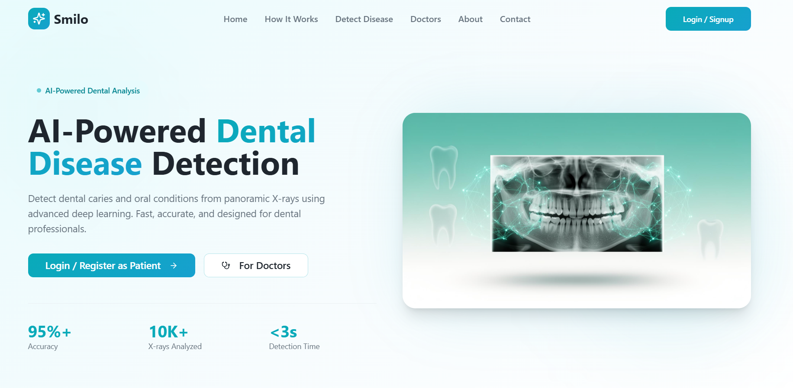
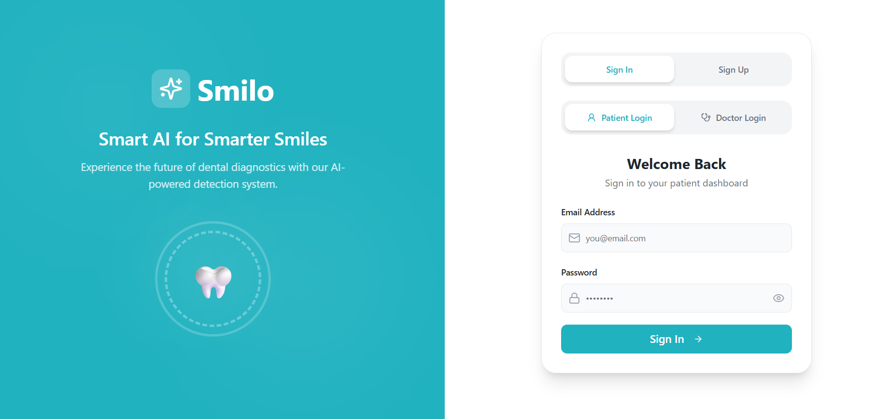
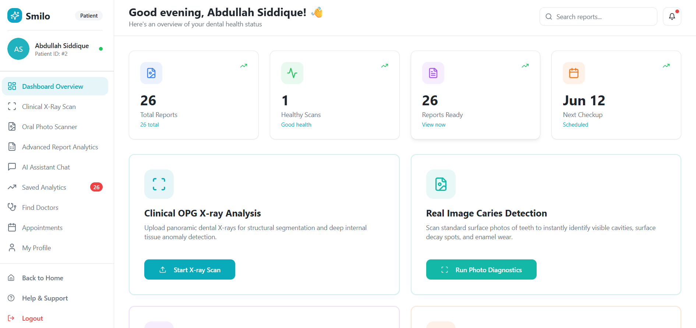
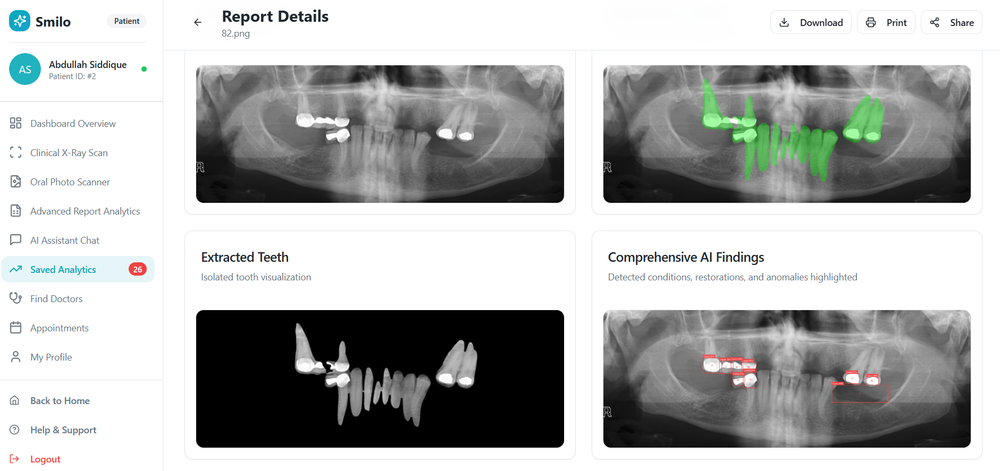
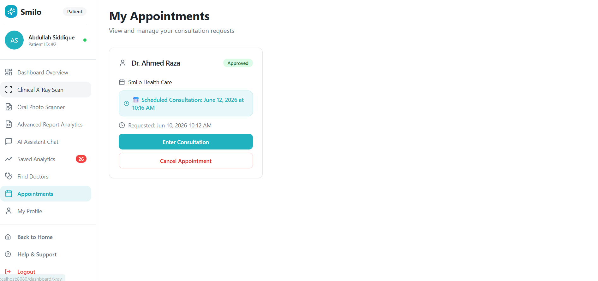

# 🦷 Smilo AI: Intelligent Dental Diagnostic & Consultation Platform

Advanced AI-powered tele-dentistry platform with multi-model analysis, real-time collaboration, and comprehensive practice management.

[](https://www.python.org/)
[](https://fastapi.tiangolo.com/)
[](https://reactjs.org/)
[](https://www.typescriptlang.org/)
[](https://github.com/ultralytics/ultralytics)
[](LICENSE)

---

## ✨ Key Features

### 🤖 Advanced AI Analysis
- U-Net for teeth segmentation in panoramic X-rays
- YOLOv8 for caries detection (X-rays & photos)
- Google Gemini for comprehensive dental photo assessment
- Groq/Llama for dental report/document analysis

### 👥 Dual Portal System
#### Patient Portal
- Dashboard with statistics
- X-Ray/Photo/Report Analysis
- AI Assistant Chat
- Find Doctors & Book Appointments
- User Reports History
- Consultation Chat with Doctor

#### Doctor Portal
- Dashboard with real-time metrics
- Pro X-Ray Studio (advanced image manipulation & annotation)
- Patient Reports Review
- Appointments Management
- Consultations Chat
- Profile Management

### 📊 Other Features
- Role-based authentication
- Real-time dashboard updates
- Responsive design (mobile-first)
- Report attachments for appointments
- Secure profile image upload

---

## 🛠️ Tech Stack

### Frontend
- React 18 + TypeScript
- Vite
- Tailwind CSS
- Shadcn UI
- Lucide React
- Framer Motion
- TanStack Query

### Backend
- FastAPI
- Uvicorn
- SQLAlchemy ORM
- SQLite
- Passlib (bcrypt)
- Pillow
- Hugging Face Hub
- Ultralytics YOLO
- Google Generative AI
- Groq

---

## 📸 Screenshots

### 🏠 Home Page


### 🔐 Login Page


### Patient Portal



### Doctor Portal




---

## 🚀 Quick Start

### Prerequisites
- Python 3.11+
- Node.js 18+
- Git

### Installation

1. **Clone repository**:
```bash
git clone <repository-url>
cd Smilo-AI
```

2. **Backend Setup**:
```bash
cd backend
python -m venv .venv
.venv\Scripts\activate  # Windows
# source .venv/bin/activate  # macOS/Linux
pip install -r ../requirements.txt
python -m uvicorn main:app --reload
```

3. **Frontend Setup** (in another terminal):
```bash
cd frontend
npm install
npm run dev
```

### Access
- Frontend: http://localhost:8081
- Backend: http://127.0.0.1:8000
- API Docs: http://127.0.0.1:8000/docs

---

## 👥 Team

- Abdullah Siddique
- Mohsin

---

## 📝 License

Educational purpose only (Final Year Project). Not for commercial use.

---

## 📧 Contact

For questions: abdullahsiddique773@gmail.com

---

## 🌟 Made with ❤️ for better dental health!

